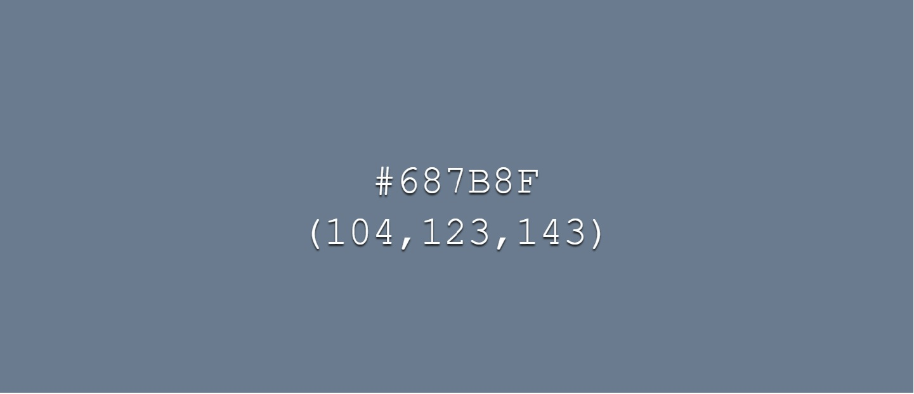

# BoxFit
BoxFit is only a prototype, let's say the vanilla version of a web application which will bring back joy to life of people who dislike cardio exercises. With BoxFit you can say Good-bye to the expensive martial-art subscriptions, coaches and other online vendors trying to sell you costly programs.

The current version of BoxFit will serve in an educational purposes but also as a means to show you how far our imagination goes, and what we want, wish and will do for our users! 
Boxfit is meant to be simple to use, a very minimalistic app with big purpose, and that puprose is to make a cardio fun again! 

The landing page is designed to be pleasant for the eyes of the users, as aforementioned before; simple and inviting. The background is carefully picked to subliminally motivate users, the flashing title is there to awake the curiosity in the users and build their interest to proceed further. The landing page has 3 buttons: "InfoBox", "Music", and "Start Session". As the word says, "InfoBox" is a button which upon the activation pops up the window that has all necessary information for a proper use of the application. "Music" button is just toggling off/on the background music, while "Start Session" leads the users to the Main Menu.

The Main Menu also contains only 3 buttons: "Easy", "Medium" and "Hard". In the Main Menu users are expected to pick the difficulty that matches their skill level and overall fitness. 
All difficulties have few things in common: there is a 15 second countdown before the main timer goes off, each round lasts for 3 minutes and there is a 10 second interval between each combination.
The differences between the difficulties are:
                        *Easy: There are 20 sequences of 3-punch combinations.
                        *Medium: There are 25 sequences of 5-punch combinations.
                        *Hard: There are 30 sequences of 7-punch combinations.
In the fist difficulty, the combinations are being called out in about 3-4 seconds allowing the users 6-7 seconds to perform full-speed punches and to get back in the boxing stance.
In the second difficulty, the voice calls out the combinations in about 4-5 seconds leaving the 5-6 seconds gap for the users to perform the attack and get back to the starting stance.
In the third difficulty, the time of 10 second interval is running short. It takes up 6-7 seconds for the combinations to be called out and only 3-4 seconds for the users to perform them. Which means, one has to be quite fast!

The right way to perform each session is to follow the lead of the voice by slowly tapping the bag in the same time the puches are called out. This way the users will build a muscle memory and reflexes. Second task is to memorize the combination and perform it with a full-speed and about 70% power - within the remaining time.
Remember: the faster delivery is, the longer the break. 

There is a 10 seconds countdown sound effect designed to alert users that the round is about to begin. The coundown sound is followed by the bell signaling the beginning of the round.
There is also a final bell indicating the end of the session, after which the users are being redirected to the outro page that serves as a "doggy treat" for the ego. The background is of a changing room with motivational quote on the wall, the image has a similar "vibe" as the image on the main page by which it is creating a visual experience and a sense of the belonging to particular gym. Upon the loading of the page there is a 5 second crowd cheering effect autoplayed to increase the dept of the experience. Now we have a sense of belonging, being celebrated, appreciated, congradulated and finally recirected to the main page, which leaves us with only one question, are you ready for the next round? Most people will because of the atomic mixure of endophines and a coctail of other happy chemicals our brains produce after such series natural stimulans. 
We're talking about complition of a difficult task in a short time, moving of the body, oxyganating with deep diaphragmatic breathing, focusing and memorising, achiving the flow state, breaking the bounderies and other self-imposed limitation. 

BoxFit is not just another sensless app, it is a step in the right direction. 
Use it or lose it, train it and gain it.

We are not going to talk in detail about the upocoming versions of BoxFit but what we want to say is that you can expect improved visual experience, greater options and adjustability. Among many other addons, there is going to be an option to chose between Boxing and Kickboxing session.

## Table of Contents
+ [UX](#ux "UX")
  + [Site Purpose](#site-purpose "Site Purpose")
  + [Site Goal](#site-goal "Site Goal")
  + [Audience](#audience "Audience")
  + [Communication](#communication "Communication")
  + [Current User Goals](#current-user-goals "Current User Goals")
  + [New User Goals](#new-user-goals "New User Goals")
+ [Design](#design "Design")
  + [Colour Scheme](#colour-scheme "Colour Scheme")
  + [Typography](#typography "Typography")
  + [Imagery](#imagery "Imagery")
+ [Features](#features "Features")
  + [Existing Features](#existing-features "Existing Features")
+ [Testing](#testing "Testing")
  + [Validator Testing](#validator-testing "Validator Testing")
  + [Unfixed Bugs](#unfixed-bugs "Unfixed Bugs")
+ [Technologies Used](#technologies-used "Technologies Used")
  + [Main Languages Used](#main-languages-used "Main Languages Used")
  + [Frameworks, Libraries & Programs Used](#frameworks-libraries-programs-used "Frameworks, Libraries & Programs Used")
+ [Deployment](#deployment "Deployment")
+ [Credits](#credits "Credits")
  + [Content](#content "Content")
  + [Media](#media "Media")

## UX

### Site Purpose:
As mentioned before, the purpose of this site is to make the cardio fun, to encourage people to exercise more often, and open themselves to the new and ortodox ways of getting fit. There's no more exuses; "It's raining, the gym is too far, I hate cardio, I need a new gear." All you need is a device and you're ready to shadow box. Do you want a full blown experience? Get a pair of gloves and boxing bag. Then just watch those calories getting burned.
Another big purpose is to give an equal access to the people of all socioeconomic backgrounds.

### Site Goal:
Our goal is to promote the healthy lifestyle and motivate people to start building new, small but positive habits which will potentially turn their lives into the right direction.

### Audience:
Free for all! There is an adage: "Age is just a number." Well, that is true in many different ways, but realistically, once we pass the certain number, things get much harder, so it is better to start taking care of your mind and body in the early age, but also, it is never to late to move, exercise, learn or try the new things in a new ways. It is so inspiring to see senior in the gym or youngsters showing up everyday and do their drills. Be the one who inspires others, stay fit and use BoxFit.

### Communication:
In this vanilla version of the app, text is short and sweet but it tells the users everything they need to know. 

### Current User Goals:
The current user goals are to exercise their focus, listening skills, memory, technicality and speed by building up the difficulty ladder. There are 75 combinations to prevent the users from boredom while their main goal is the mastery. 

### New User Goals:
BoxFit has a guideline and yet has no rules. We advocate the creativity and unique approaches to everything, so feel free to explore the ways of the new use of the app. Keep it down a notch, or add an another challenge. Add evasion, dodge inbetween the punches. Keep moving, or just stay still and while delivering the soft blows. The options are unlimites, just as you are!

### Future Goals:
Future goals are to expand the app in many different ways, which will stay a secret for the time being. What we're going to share with you is that there is going to be a premium version of BoxFit in which the subscribed users will have all moves explained and demonstrated in the series of short videos. The subscription fee in it's entirety will be given for the charitable purposes.

## Design
(assets/images/color2.jpg)(assets/images/color3.jpg)

### Colour Scheme:
The colours used are 50 shades of gray. We decided to go with darker and elegant colours in this design to achieve the rustic and raw feel. After all, BoxFit is not an app for cuddling.
White is used to make a nice contrast to the gray backgrounds. 

### Typography:
The fonts used in this project are very much plane. Montserrat & Inter. Unlike in previous Project where we went above and beyond, this one is meant to be simple and pretty much minimalistic just to see how much we can achieve without putting an endless hours in style and design. 

### Imagery:
All the images were carefully picked and combined to make the user experience uniuqe and sensible to feeling as to sight.

#### Features and pages:
![Index](assets/images/index.jpg
![InfoBox](assets/images/infobox.jpg
![MainMenu](assets/images/menu.jpg
![BoxFit](assets/images/boxfit.jpg
![Outro](assets/images/outro1.jpg

Last minuts of coding -> The rest of the README.md will be left unfinished. 
I have had only three days to work on this project.

